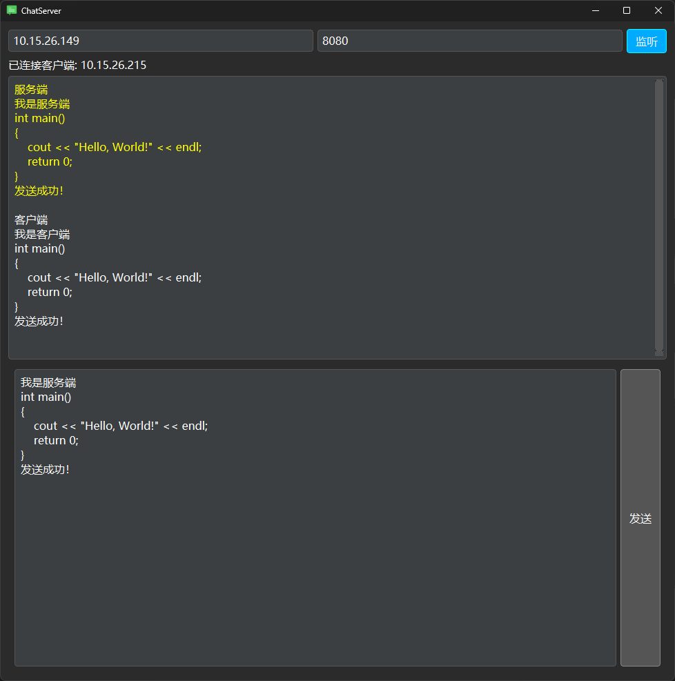
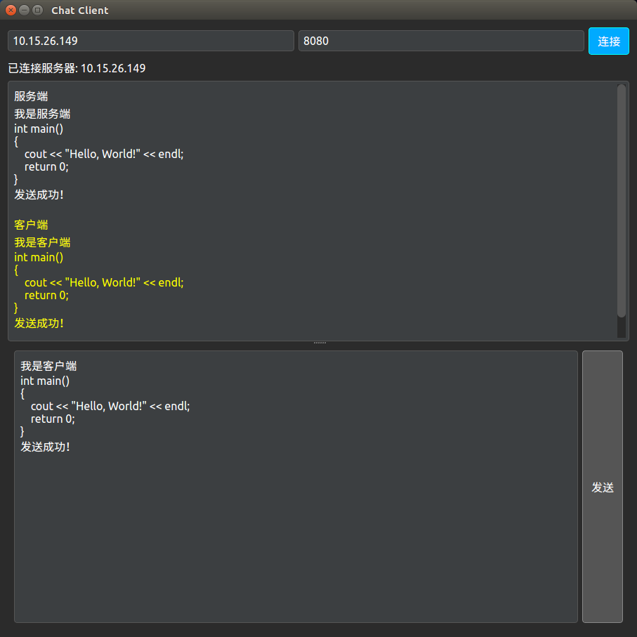
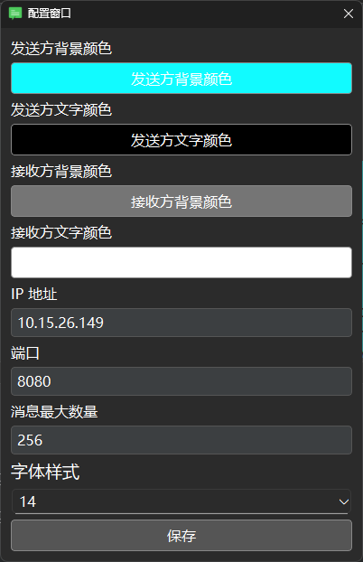

# LAN-Messenger-Tool
本项目是一款针对局域网内嵌入式开发的简易消息发送工具，解决了在开发调试过程中信息传递不便的问题。相比传统的文件传输工具或即时通讯软件，本工具专注于快速、稳定、不受字数限制、跨设备、阔平台无乱码的文本消息通信，无需依赖外部网络。

开发本工具的初衷是：在嵌入式开发过程中，复制粘贴文本效率低、某些通讯软件发送多行内容可能乱码或受字数限制，导致开发调试不便。因此设计了这套轻量级工具，实现局域网内快速消息发送与接收。

# 功能特性

  跨平台支持：Windows 和 Linux
  
  服务端 IP 未指定时自动检测本机所有网口
  
  消息稳定传输：支持任意长度文本、多行内容，无乱码
  
  自动重连：断开连接后自动尝试重连
  
  轻量易用：界面简洁，部署简单
  
  无需登录

# 使用场景

  局域网内嵌入式开发调试
  
  跨设备传递代码片段或日志信息
  
  替代微信在局域网内的临时消息传递
  
  实时协助测试或调试嵌入式设备

# 更新日志 v2025-9—5

  # 新增功能：

  气泡消息：支持消息以气泡形式显示。
  
  清空消息：一键清空聊天记录。
  
  超时重连时间：设置连接超时后自动重连的时间。
  
  右键操作：气泡消息支持右键全选和复制。

  键盘操作：点击气泡后快捷键全选和复制。
  
  连接状态显示：显示连接断开或失败的原因。
  
  重连次数显示：显示当前重连的次数。

  无法重连的连接失败处理：在连接失败且无法重连时，自动停止重连并显示错误信息，避免重复尝试连接。

  # 新增配置项：

  气泡颜色：可自定义气泡背景颜色。
  
  文字颜色：可自定义消息文字颜色。
  
  字体大小：支持调整消息显示字体大小。
  
  默认IP配置：可设置默认连接的 IP。
  
  默认最大重连次数配置：可设置默认最大重连次数，超过之后不再重连。
  
  默认端口配置：可设置默认连接端口。
  
  历史消息最大数量：可配置最大历史消息存储数量。

# 依赖环境

Qt 5 或 6（支持跨平台 GUI 开发）

# 快速使用

编译服务端和客户端程序

启动服务端（可指定 IP，也可留空自动检测），点击监听

启动客户端，输入目标 IP ，点击连接

连接成功后即可通讯

